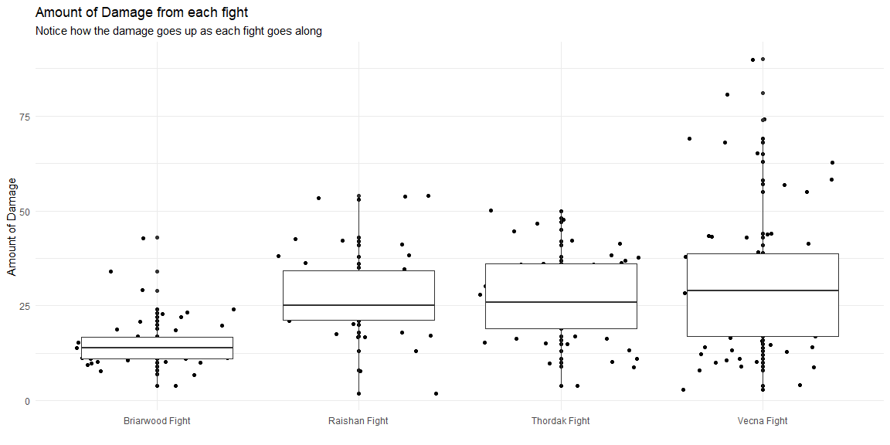

```r
# Use this R-Chunk to import all your datasets!

VecnaFight <- read_csv("Ep114CritRole.csv")
ThordakFight <- read_csv("Ep79CritRole.csv")
BriarwoodFight <- read_csv("Ep34CritRole.csv")
RaishanFight <- read_csv("Ep83CritRole.csv")
```

## Background

Critical Role is an online show with nerdy voice actors playing the very popular game Dungeons and Dragons. It is a very fun showed filled with high fantasy, drama, comedy, and lots, and lots, of rolling of dice. Which is good news for data people because all those numbers translates BRILLIANTLY into juicy data for us to play with. Critical Role has gained immense popularity over the years and as such a volunteer group started compiling all those dice rolls into cute sets and summaries. They are called CritRoleStats and they were kind and smart enough to put thier compiled datasets on thier website. 

I decided to pick the four biggest battles from the first season (or campaign) of the show and analyse thier total rolls, total damage, and how each compared to the last. The entire season spans 115 episodes and the four I chose are very evenly distributed among that stretch. They are the Briarwood Fight, The Thordak Fight, The Raishan Fight, and the Vecna Fight. I do not think you are too terribly interested in what the adventurers fought, but, those are the names of the creatures anyway.

## Data Wrangling


```r
# Use this R-Chunk to clean & wrangle your data!

BriarwoodFight <- BriarwoodFight %>% 
  select(c(Episode:Notes)) %>% 
  mutate(onlyDamage = as.numeric(`Damage Dealt` %>% str_extract("[:digit:]{1,2}")))

ThordakFight <- ThordakFight %>% 
  mutate(onlyDamage = as.numeric(Damage %>% str_extract("[:digit:]{1,2}")))

RaishanFight <- RaishanFight %>% 
  mutate(onlyDamage = as.numeric(Damage %>% str_extract("[:digit:]{1,2}")))

VecnaFight <- VecnaFight %>% 
  mutate(onlyDamage = as.numeric(Damage %>% str_extract("[:digit:]{1,2}")))
  
BriarwoodDamage <- BriarwoodFight %>% 
  select(Episode:`Type of Roll`,onlyDamage) %>% 
  filter(`Type of Roll` == "Damage",
         onlyDamage > 0) %>% na.omit()
  
ThordakDamage <- ThordakFight %>% 
  select(Episode:`Type of Roll`,onlyDamage) %>% 
  filter(`Type of Roll` == "Damage",
         onlyDamage > 0) %>% na.omit()
  
RaishanDamage <- RaishanFight %>% 
  select(Episode:`Type of Roll`,onlyDamage) %>% 
  filter(`Type of Roll` == "Damage",
         onlyDamage > 0) %>%  na.omit()
  
VecnaDamage <- VecnaFight %>% 
  select(Episode:`Type of Roll`,onlyDamage) %>% 
  filter(`Type of Roll` == "Damage",
         onlyDamage > 0) %>% na.omit()
  
AllFightsDamage <- bind_rows(BriarwoodDamage,ThordakDamage,RaishanDamage,VecnaDamage) %>% 
  mutate(Ep = as.factor(Episode),
         Fight = case_when(
           Episode == 34 ~ "Briarwood Fight",
           Episode == 79 ~ "Thordak Fight",
           Episode == 83 ~ "Raishan Fight",
           Episode == 114 ~ "Vecna Fight"
         ))
```

The wrangling posed a bit of a problem. While CritRoleStats were gracious enough to put up their datasets for anyone to use, they... didn't do a very good job of making it. The damage column, in particular, had other unnecessary letters and numbers in it. I do not know why they did it that way but it made my project look more impressive so, you know, ups and downs. 

## Data Visualization

```r
# Use this R-Chunk to plot & visualize your data!
BriarwoodFight %>% 
  ggplot(aes(x = fct_infreq(`Type of Roll`))) +
  geom_bar(stat = "count") +
  geom_text(aes(label=..count..),stat = "count", vjust=-0.3, size=3.5) +
  labs(title = "Rolls from the Briarwood Fight") +
  theme_bw() +
  theme(axis.text.x = element_text(angle = 55, vjust = 1, hjust = 1)) +
  xlab("Type of Roll") +
  ylab("")
```

<!-- -->

```r
ThordakFight %>% 
  ggplot(aes(x = fct_infreq(`Type of Roll`))) +
  geom_bar(stat = "count") +
  geom_text(aes(label=..count..),stat = "count", vjust=-0.3, size=3.5) +
  labs(title = "Rolls from the Thordak Fight") +
  theme_bw() +
  theme(axis.text.x = element_text(angle = 55, vjust = 1, hjust = 1)) +
  xlab("Type of Roll") +
  ylab("")
```

<!-- -->

```r
RaishanFight %>% 
  ggplot(aes(x = fct_infreq(`Type of Roll`))) +
  geom_bar(stat = "count") +
  geom_text(aes(label=..count..),stat = "count", vjust=-0.3, size=3.5) +
  labs(title = "Rolls from the Raishan Fight") +
  theme_bw() +
  theme(axis.text.x = element_text(angle = 55, vjust = 1, hjust = 1)) +
  xlab("Type of Roll") +
  ylab("")
```

<!-- -->

```r
VecnaFight %>% 
  ggplot(aes(x = fct_infreq(`Type of Roll`))) +
  geom_bar(stat = "count") +
  geom_text(aes(label=..count..),stat = "count", vjust=-0.3, size=3.5) +
  labs(title = "Rolls from the Vecna Fight") +
  theme_bw() +
  theme(axis.text.x = element_text(angle = 55, vjust = 1, hjust = 1)) +
  xlab("Type of Roll") +
  ylab("")
```

<!-- -->

```r
AllFightsDamage %>% 
  ggplot(aes(x = Fight, y = onlyDamage)) +
  geom_point() +
  geom_jitter() +
  geom_boxplot() +
  theme_minimal() +
  labs(title = "Amount of Damage from each fight",
       subtitle = "Notice how the damage goes up as each fight goes along") +
  xlab("") +
  ylab("Amount of Damage")
```

<!-- -->

```r
AllFightsDamage %>% 
  ggplot(aes(x = fct_infreq(Character), y = onlyDamage)) +
  geom_bar(stat = "identity") +
  theme_bw() +
  labs(title = "Amount of total damage each character did through all of those fights") +
  xlab("") +
  ylab("Amount of total damage")
```

<!-- -->

## Conclusions

All in all I think I did a very good job on this project. I found something I liked and I got the data for it. I wrangled it to work with my curiosities and now I have some pretty decent graphics to show and some questions that I can answer.
